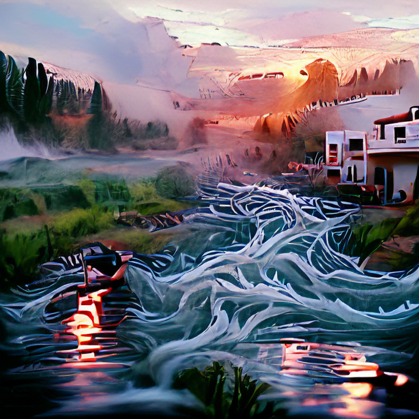

# Openart project.

Once upon a time, when I'm listening to the song "Rivers flow in you" I see the article about making a very beautiful image of VQGAN-clip.

I'm a bit surprised of the output. It's amazing and eye catching.

### Some samples

- 
- 
- 
- 

### Reference
- https://ml.berkeley.edu/blog/posts/clip-art/ 
